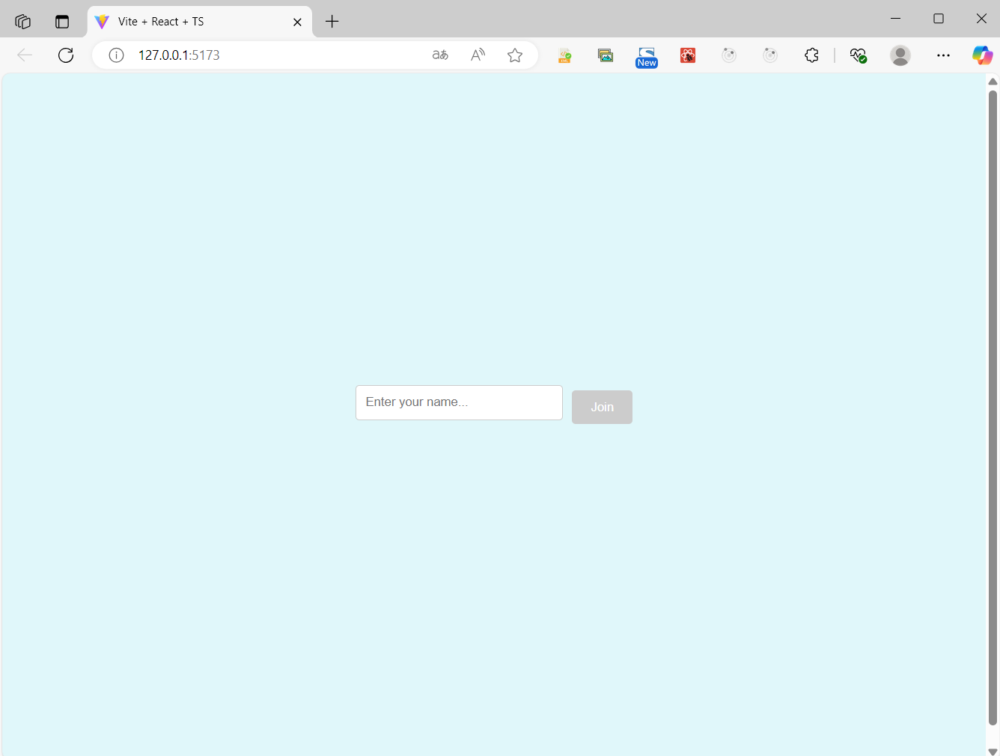
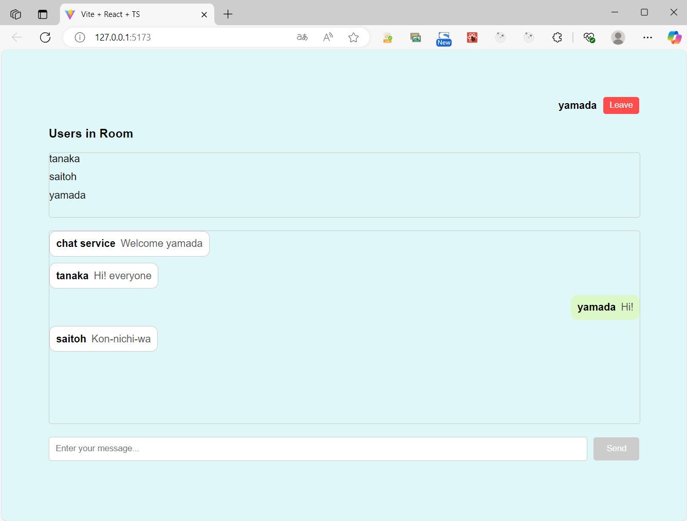

# Chat Application

This is a simple real-time chat application built using React, TypeScript, WebSocket, and Node.js.

## Technologies Used

### Client Side

- React: 18.3.1
- Vite: 6.0.5
- TypeScript: 5.6.2

### Server Side

- Node.js: 21.2.0
- Express: 4.21.2
- WebSocket: 4.8.1

## Screenshots

Below are the screenshots of the application showcasing the entrance screen and chat screen.

### Entrance Screen

This is where users can enter their username and click "Join" to enter the chat room.



### Chat Screen

Once the user has joined the room, they are taken to the chat screen. The user's name is displayed in the top right corner, and they can send messages to other users in the room.



## Features

### Entrance Screen

- A textbox for entering the "Username".
- A "Join" button to proceed to the chat screen after entering the username.

### Chat Screen

- The "Username" is displayed in the top right corner.
- A "Leave" button that returns to the entrance screen.
- A "Users in Room" area displaying the list of users currently in the room.
- A "Chat Message List" area displaying the messages sent by users.
- A "Message Input" textbox and a "Send" button. Clicking the "Send" button sends the message, which will then appear in the "Chat Message List" area.

## Installation Instructions

To clone the repository, run the following command:

```bash
git clone https://github.com/yutnagase/react-websocket-chat.git
cd react-websocket-chat
```

### Server Setup and Launch

To set up and start the server, run the following commands:

```bash
cd server
npm i
npm run start
```

### Client Setup and Launch

To set up and launch the client, open a new terminal and run the following commands:

```bash
cd client
npm i
npm run dev
```

Note: The setup instructions are based on using Visual Studio Code as the editor.

## Additional Notes

This application provides a smooth real-time communication experience thanks to WebSockets. It allows users to join a room, chat with others, and view messages instantly. It is an excellent starting point for building more complex chat applications or integrating with other tools and services.

Feel free to extend the functionality by adding features like private messaging, rooms, or authentication. With React and Node.js, the possibilities are endless!

---

Thank you for checking out this project. Enjoy exploring and enhancing the chat experience!

## License

This project is licensed under the MIT License - see the [LICENSE](LICENSE) file for details. You are free to use, modify, and distribute this software for personal, academic, or commercial purposes.
